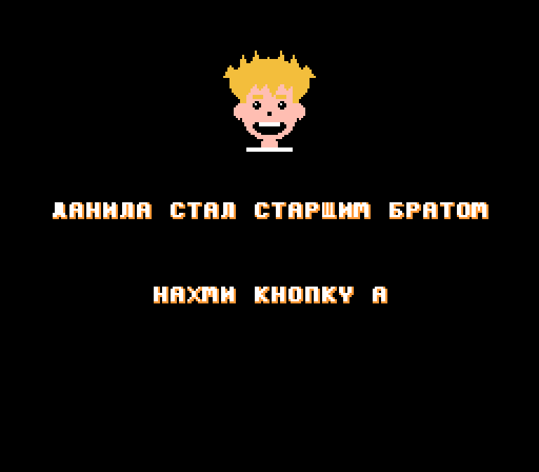
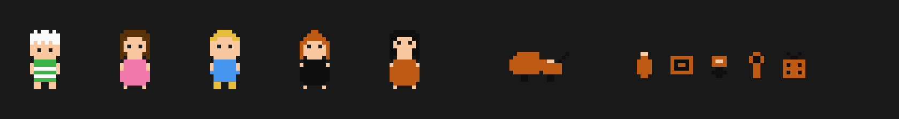
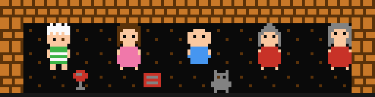

# Данила стал старшим братом

Игра для NES, которую папа делает в подарок сыну Даниле — к появлению младшей
сестрёнки. Запускается на ретро-консоли R36S (и в любом эмуляторе NES).





## Сюжет

Платформер в духе Марио: Данила прыгает по комнатам дома и собирает вещи
для младшей сестрёнки. Четыре уровня — гостиная, детская, кухня и ночная
улица; перед каждым напутствие от мамы Карины, папы Жени или бабушек Инны
и Вики. В финале — вся семья и Данила, качающий тёмно-золотую коляску.
(Ранняя версия с видом сверху сохранена в old_topdown_game.c.)

## Как собрать локально

Нужен только компилятор [cc65](https://cc65.github.io/) (в Ubuntu/Debian —
`sudo apt install cc65`, на macOS — `brew install cc65`). Библиотека
neslib уже лежит в репозитории, в папке `neslib/` — ничего скачивать
отдельно не нужно.

```sh
make            # соберёт game.nes
make run        # соберёт и сразу откроет в fceux (если он установлен)
```

Готовый `game.nes` запускается в любом NES-эмуляторе на компьютере
(например, [FCEUX](https://fceux.com/) или [Mesen](https://www.mesen.ca/)):
`fceux game.nes`.

## Как собрать в браузере (запасной способ)

Если cc65 ставить не хочется, проект по-прежнему собирается на
[8bitworkshop.com](https://8bitworkshop.com), платформа **NES**:

1. Вставить `game.c` в файл game.c проекта.
2. Через меню ☰ → *File* → *Add Linked File...* создать `chr_ru.s`
   и вставить содержимое одноимённого файла из этого репозитория.
3. Игра соберётся автоматически. Скачать ROM: кнопка Download → `.nes`.

## Как запустить на R36S

Скачанный `.nes`-файл положить на SD-карту в папку ROMS/NES —
игра появится в меню консоли.

## Что под капотом

- Чистый C (компилятор cc65) + библиотека neslib (лежит в `neslib/`),
  без скроллинга: экраны сменяются целиком, как в первой Zelda.
- Русский шрифт нарисован прямо в тайлах; в коде текст пишется транслитом,
  игра расшифровывает его на лету (шпаргалка — в комментариях game.c).
- Персонажи, предметы и диалоги — это таблицы данных, а не код.
- Портрет Данилы на титульном экране — 6×6 фоновых тайлов, раскрашенных
  через таблицу атрибутов.

## Журнал разработки

- Дни 1–2 — конвейер: 8bitworkshop, движущийся квадрат, первый ROM
- Дни 3–4 — комната со стенами и мебелью, вторая комната, дверь
- День 5 — мама и окно диалога
- День 6 — русский шрифт в тайлах
- День 7 — предметы, счётчик, квест
- День 8 — вся семья, диалоги по именам
- Дни 9–10 — графика: портрет, спрайты семьи, кирпичи; уровень-пробежка
- День 10+ — переработка в платформер: 4 уровня, заставки, финал с коляской
- День 11 — локальная сборка через cc65 и Makefile, почищена буква "Ж" и
  "Ш" в шрифте (раньше рисовались сплошным чёрным прямоугольником)
- Впереди — звук, полировка финала, тест на консоли

Игру сделал папа. Арт-директор — Данила.
